<h1 align="center">Portfolio Project Two - Javascript</h1>

## Live Site
[Whack A Mole](https://chris-townsend.github.io/project-two/index.html)

#

## Repository
[https://github.com/chris-townsend/project-two](https://github.com/chris-townsend/project-two)

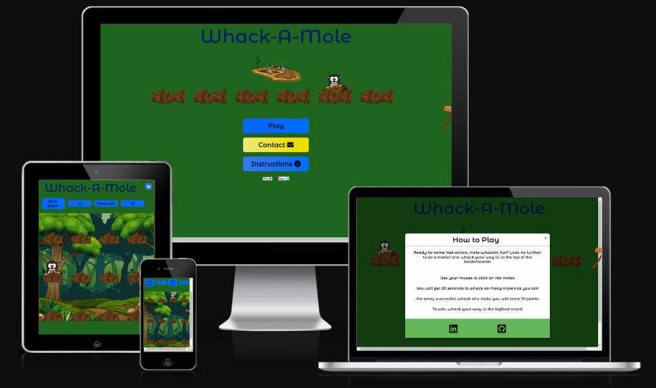
***

## Contents
- [Objective](#Objective)
- [Brief](#Brief)
- [User Experience(UX)](#user-experience-ux)
- [Design](#Design)
    - [Colour Scheme](#Colour-Scheme)
    - [Typography](#Typography)
    - [Imagery](#Imagery)
- [Wireframes](#Wireframes)
- [Features](#Features)
    - [Features Left to Implement](#Future-Features)
    - [Languages Used](#languages-Used)
- [Technologies Used](#programs-frameworks--libraries-used)
- [Testing](#testing)
    - [W3C Validator Results](#homepage)
    - [Google Lighthouse Results](#lighthouse-homepage)
    - [JShint Results](#jshint-homepage)
    - [Testing Stories for UX](#testing-user-stories-from-user-experience-ux-section)
    - [Further Testing](#Further-Testing)
- [Bugs](#Known-Bugs)
- [Deployment](#Deployment)
    - [GitHub Pages](#GitHub-Pages)
    - [Forking the GitHub Repository](#forking-the-github-repository)
    - [Making a local Clone](#making-a-local-clone)
- [Credits](#Credits)
    - [Content](#Content)
    - [Media](#Media)
    - [Acknowledgements](#Acknowledgements)

***

## Objective
#
In this project I intend to make a small game which is easily understood and intuitive to play. It will be based on the classic arcade game Whack-A-Mole where you are given a mallet to hit the moles; as they pop out, you are given a point for each mole hit. I'll be using HTML, CSS and Javascript to make the game and it's designed to be a fun and entertaining game to help pass time. 

***

## Brief & Target Audience 
# 
The game will be designed for a target audience of 8 years +. The game will be easily laid out with an instructions pop up modal on the homepage. The site will have clear images and sounds responsive to actions made by the user. The game music will have an option to play/pause and stop to prevent autoplaying and give the user a call of action. The game will be timed and the user will know how much time is remaining from the countdown tab above the game board.  

***

## User Experience (UX)
#

-   ### User Requirements

    1. As a first time user, I want to easily understand how to play the game.

    2. As a user I want the ability to control any background sounds playing. 

    3. As a user I want to be able to see my current score.

    4. As a user I want to recieve an alert at the end of gameplay with my final score. 

    5. As a user I want simple gameplay which is easy to play again.

    6. As a frequent user, I would like to see the Highscores.

    7. As a frequent user, I want to check to see if there are any new games available to play by clicking on the developers social media icons clearly laid out at the bottom of the highscores and Instructions modal. 

    8. As a user I want the ability to play the game on multiple devices.
    
     ***

-   ### Design
#
-   #### Colour Scheme
    
     - The colour scheme was picked using coolers. I used these colours because I felt they complimented each other well, It gives the game a fun and cheerful feel and the contrast works well for user reading accessability. The game buttons on the homepage and gamepage have been styled using a background linear-gradient to add to the styled effect.

    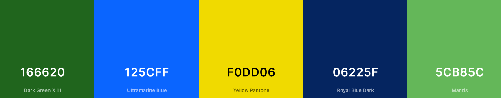

    ***
    -   #### Typography
    #
    The fonts are imported into the CSS file from *[Google Fonts](https://fonts.google.com/)* 

    - The **Montserrat Alternates** font is the main font used throughout the game with **Sans Serif** as the fallback font in case for any reason the font isn't being imported into the site correctly. **Montserrat Alternates** was choosen because it has clear lettering which allows easy reading accessabillity for the user. The buttons on the gamepage are styled with the **Montserrat Alternates** font and this nicely contrasts with the background colour. 
 
    

    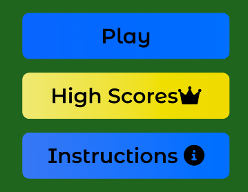

    ***
        
*   ### Wireframes
#

-   Desktop Wireframe Home page  -
    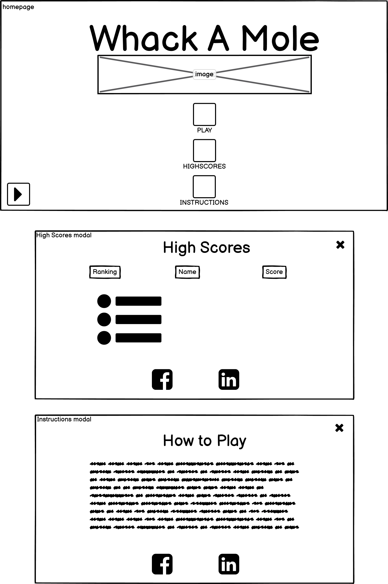

-   Desktop Wireframe Game page  - 
    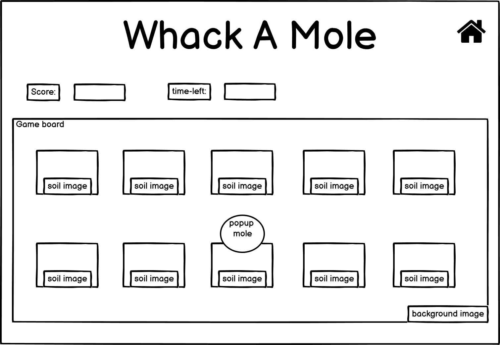

-   Mobile Wireframe Home page -

     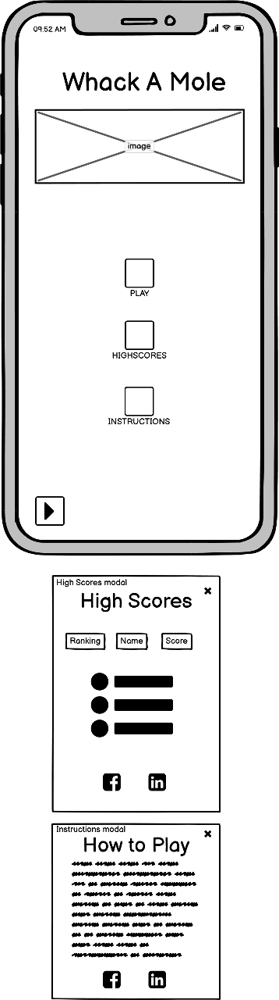

-   Mobile Wireframe Game page -

     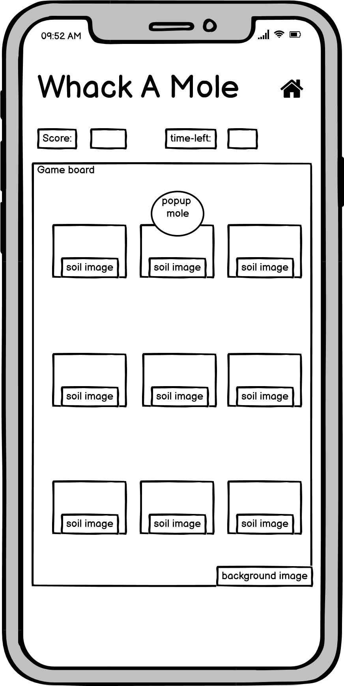

***    

## Features
#

I have used [Responsinator](http://www.responsinator.com/) to check the responsiveness on different devices. The site is responsive on all devices displayed, including ios devices. 

 - [Responsinator Results](http://www.responsinator.com/?url=https%3A%2F%2Fchris-townsend.github.io%2Fproject-two%2Findex.html)

#

1. Whack A Mole Heading - When you first arrive on the homepage, the main heading "Whack-A-Mole" flashes up and grow on the screen over 2 seconds. This has been accomplished by using *keyframes* with *image-grow*. I have added a suitable image of a man digging a hole under the main heading which also grows on the screen with the heading. The heading and image has been set to grow from a scale of 0.4 to 1.

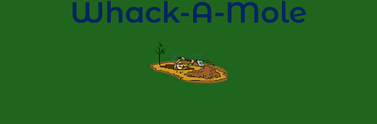
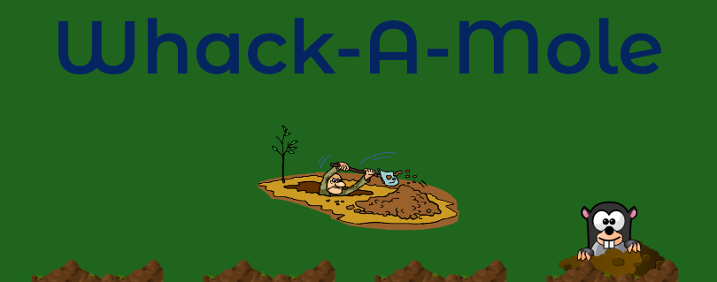

2. Homepage game animation - Below my title, I have added an animation of the game. The moles will pop up randomly on the holes, This has been added as a bit of fun and to engage the user. I have created this from using the same javascript code as on my game page. Unfortunatly this was throwing quite a lot of errors in the console due to using the same code but on a different page - please see testing and known bugs for more information.

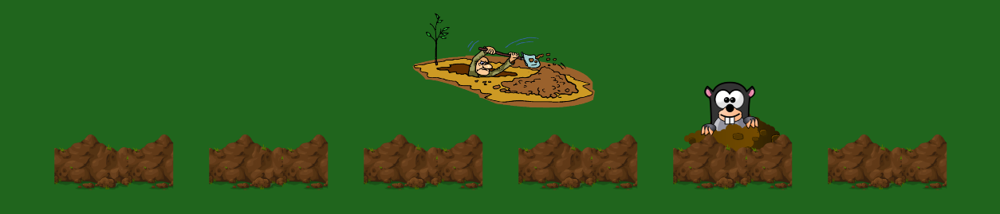

3. Home buttons - Under my animation I have added 3 buttons, Play which directs you to the game page and a Highscores and Instructions button which open up as pop-up modals. I have added style to the buttons when hovered over to give feedback to the user that is it interative. Icons have been added to the Highscores and Instructions buttons to give more UX.

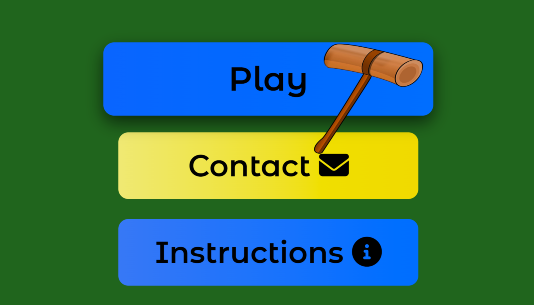

4. Contact Modal - The contact modal has been styled similar to the instructions modal in terms of style and features. The X to close the modal changes colour on hover to give feedback to the user and also a user can click anywhere outside the modal to close it. 
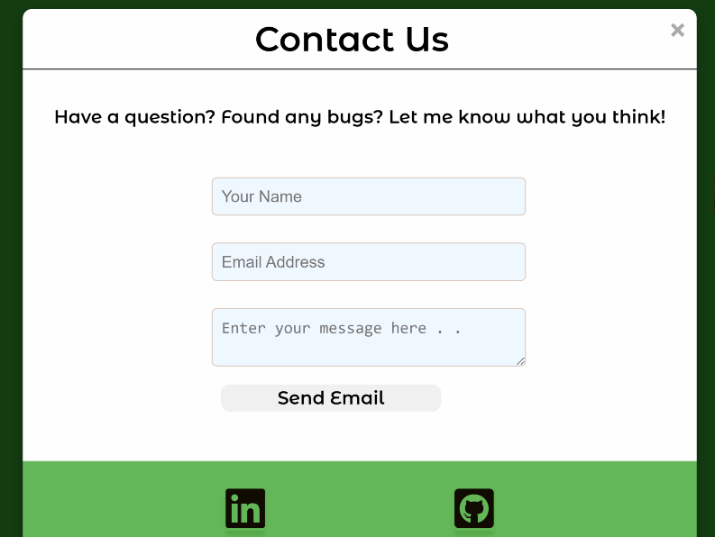

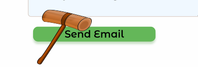

On hover of the send-email button, it turn's green to give feedback to the user and shows interativity.
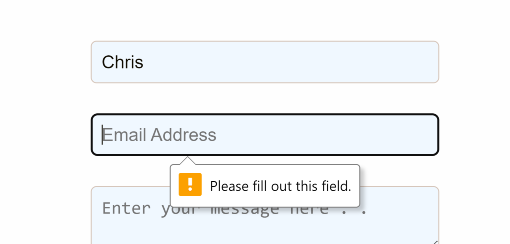

The contact form will pop up with a *required* warning box if the form has not been filled out correctly. It requires a name and email address for the form to be accepted.

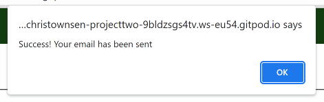

Upon successful completion of the form, the form has been set up to be recieved via [Email.JS](https://www.emailjs.com/). This was made possible by following the steps below:

 - I first created an account with [Email.JS](https://www.emailjs.com/).

 - Next I set up an email service to link to my Email.js account.

 - Add a new email template and create three Id's which will correspond to your javascript function, one for name, email_id and message.

 - Copy the Email.js SDK into the head of your HTML file and add your personal public key to the emailjs.init parameter - It must be placed here to work.

 - Create a JavaScript file and create the function which gets the params from the contact form, add the nessecary onclick feature and Id's to the HTML code. 
 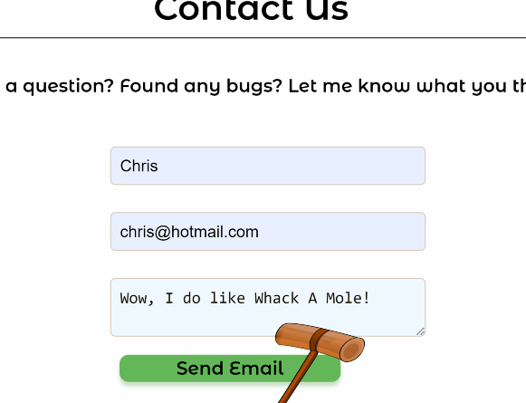
 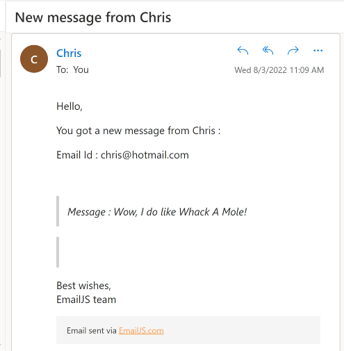

5. Instructions Modal - When the Instructions button is clicked the Instructions pop-up modal will appear and the background is darkened slighty to cover the homepage. The font used within this modal has been kept as Montserrat Alternates to keep the style consistant through-out. The Instructions have been kept simple so that they are easy to understand. The X to close the Instructions box changes colour on hover to give feedback to the user that it is interactive. It is located in the top right of the box. Another added feature for closing the modal is that a user can click anywhere outside the box to get back onto the game page. This was implemented for the age demographic of the game; they might not see the X button in the top right corner and it is slightly harder to click on smaller objects with the mallet cursor. 

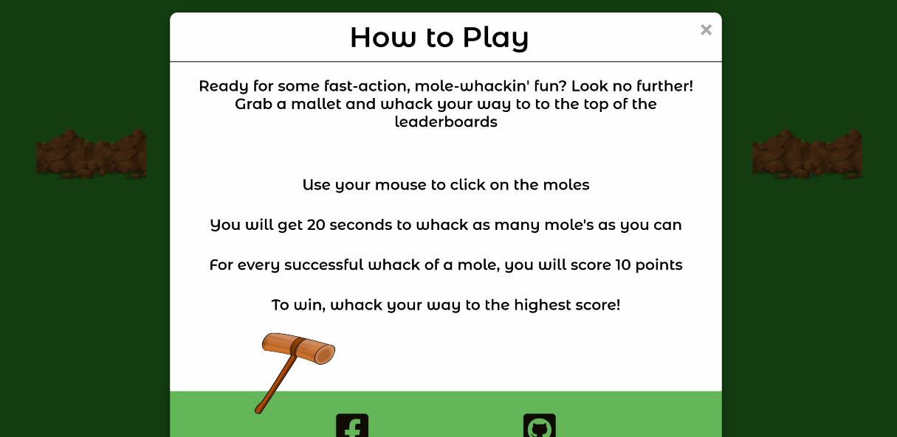

6. Social Icons - The social media icons that have been added to the footer of my modals have been made **interative** by using the *hover*: *transform* function. I have used a box shadow for when an icon is hovered over so that the user acknowedges the action. 

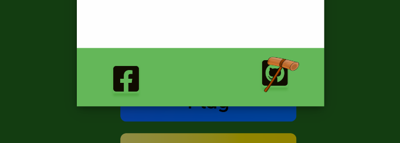

7. Audio Buttons - At the bottom of my homepage I have added a footer and within it are my audio buttons. The buttons give the user the option to play/pause and stop the audio. As the buttons are quite small, it's sometimes hard to click on them with the mallet cursor. I have added a pointer cursor so that the user knows when they are hovering over these buttons. The audio is a fun jazz track which was picked to be fairly short, just long enough to read the instructions before clicking onto the game page.  

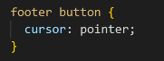

8. Mallet Cursor - For extra customization and interactivity I have added a cartoon mallet as a cursor when using a mouse. The co-ordinates for the cursor have been set using javascript and css to allow an animation of a whacking hammer when the mouse is clicked.  

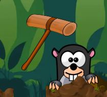

9. Game Timer - The Game will start immediatly after clicking the Play button on the homepage and the timer will begin counting down from 20 seconds. The timer is displayed as Time Left and is easy to see while playing the game. When the timer reaches 0 an alert will pop up to tell the user the game is over and gives them there personal score. 

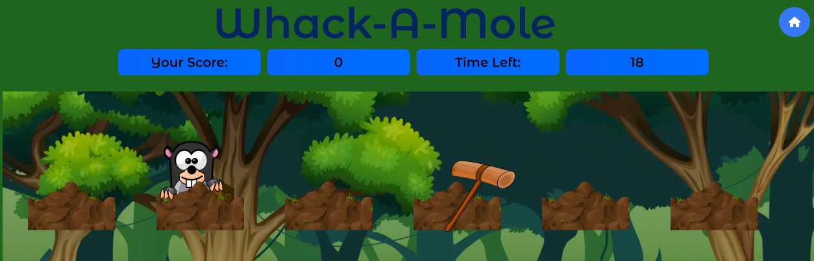
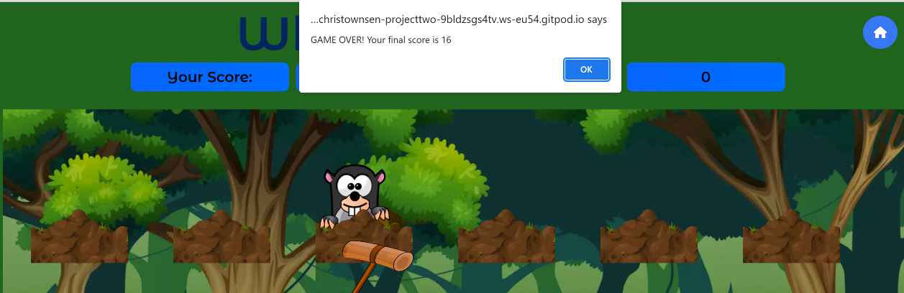

10. Game Scoreboard - The Scoreboard can easily be seen during gameplay and its displayed as Your Score on the game page. The Scoreboard has been styled in a similar style to the homescreen buttons. For every successful hit of a mole the score counter will +1. At the end of the game an alert will pop up with the number of successful moles hits.

11. Home button on game page - On the right hand side of the game page, at the top, there is a home icon which when clicked will take you back to the homepage. I have added the css hover effect to add interactivity and to acknowledge the user when the button is being hovered over. The blue circle icon will hide into the green background and only the white house will be displayed.

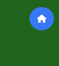
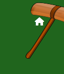

12. Mole Favicon - A favicon was generated by uploading a mole image for the logo to [Favicon Generator](https://favicon.io/favicon-converter/). The icon is created and then saved in the game images folder and linked in the head section of the html. The favicon was created with the theme of whack-a-mole and chosen to be associated with this website as an extra visual support for the user. It should create brand awareness and recognizability for the user and help them find the page quicker and easier.

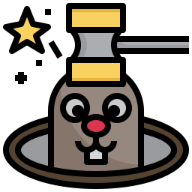

***
## Future Features
#
With more time, I would have liked to of implemented the following ideas:

- Display a highscores list linked to local storage - At first I had my contact modal set up as a highscore list but changed it to a contact form due to not having enough infomation about JSON.stringify and local storage. Below is an image of the original highscores button. 

- Add objects to increase the difficulty - Add an object such as a rabbit and if that object is hit you minus one point. 

- Add a different mole image to show when a mole has been hit, incase the sound effects don't work on a particular device.

### Languages Used
#

-   [HTML5](https://en.wikipedia.org/wiki/HTML5)
-   [CSS3](https://en.wikipedia.org/wiki/Cascading_Style_Sheets)
-   [JS](https://en.wikipedia.org/wiki/JavaScript)

### Programs, Frameworks & Libraries Used
#

- [Balsamiq:](https://balsamiq.com/) Balsamiq was used to create the wireframes during the design process.

- [Pixlr:](https://pixlr.com/x/) Pixlr was used to resize and change the format of my images.

- [Coolors:](https://coolors.co/) Coolors was used to pick a colour scheme and check contrast. 

- [TinyPNG:](https://tinypng.com/) All images within the project have been processed through their free compression tool.

- [Hover.css:](https://ianlunn.github.io/Hover/) Hover.css was used on the Social Media icons on the instructions modal footer to add the float transition while being hovered over.

- [Google Fonts:](https://fonts.google.com/) Google fonts were used to import the 'Montserrat Alternates' font into the style.css file..

- [Font Awesome:](https://fontawesome.com/) Font Awesome was used throughout the website to add icons for aesthetic and UX purposes.

- [Google DevTools:](https://developer.chrome.com/docs/devtools/) Once the website was made to a basic deployment level, Google DevTools was used frequently to resize objects within the site, very helpful for making my website responsive.

- [Git](https://git-scm.com/) Git was used for version control by utilizing the Gitpod terminal to commit to Git and Push to GitHub.

- [GitHub:](https://github.com/) GitHub is used to store the projects code after being pushed from Git.

- [W3C Markup Validator:](https://validator.w3.org/) This site was used to ensure that my HTML and CSS was error free. I had to push my code to ensure it was updated and then add the URL of the website to the address bar which then checked for errors or warnings.

- [Favicon Generator:](https://favicon.io/favicon-converter/) This was used to create my favicon icon. 

 - [Slack:](https://slack.com/intl/en-gb/) Slack is a an online messaging service which allows poeple to collaberate with their workspaces. Slack was incredibly useful for advice from students and tutors.

 - [YouTube:](https://www.youtube.com/) YouTube is a free video sharing website, it has been very useful for watching videos on positioning using flexbox. 

 - [Audio Compressor](https://www.media.io/audio-compressor.html) Media.io was used to compress my audio files without loosing quality. 

 - [Compressor.io](https://compressor.io/)* This was used to reduce the size and load times of my images. 

## Testing
#

The W3C Markup Validator and W3C CSS Validator Services were used to validate every page of the project to ensure there were no syntax errors in the project. The results are shown below:

-   [W3C HTML Markup Validator](https://validator.w3.org/) Results
### Homepage
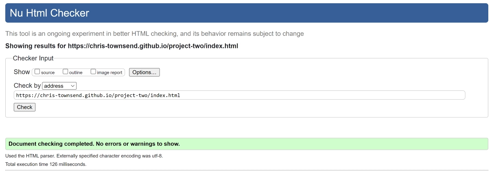
### Game Page
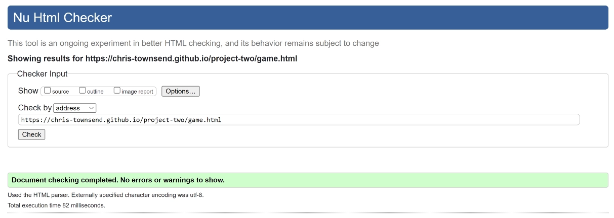

-   [W3C CSS Markup Validator](https://jigsaw.w3.org/css-validator/) Results

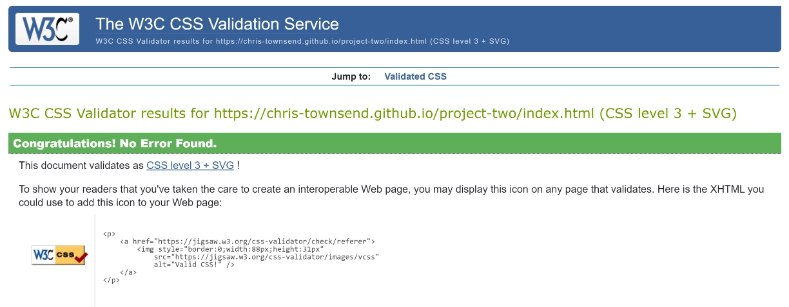

I have run the website through Google Chrome's lighthouse audit application and the results are shown below:

- Mobile
### Lighthouse Homepage
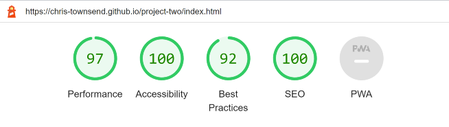
###  Lighthouse Game Page
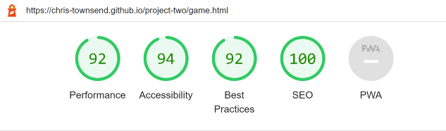

- Desktop
### Homepage
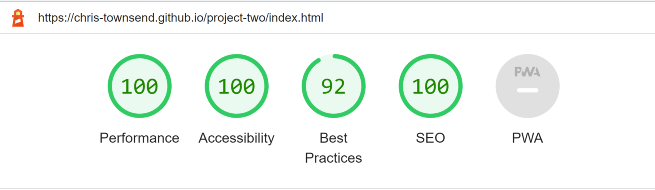
### Game Page
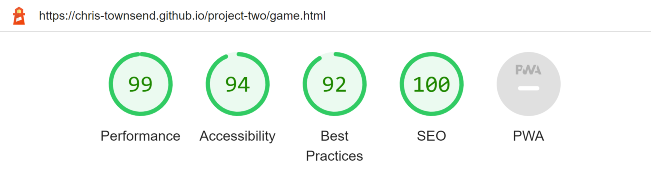

I have run the website through JSHint's audit application and the results are shown below:

### JSHint Homepage
The results for the homepage show no significant errors but emailjs is showing up as a undefined variable. This is part of the emailJS API which is linked in the head of the HTML document. SendMail is showing up as an unused variable but this is being used in the HTML document as an onclick
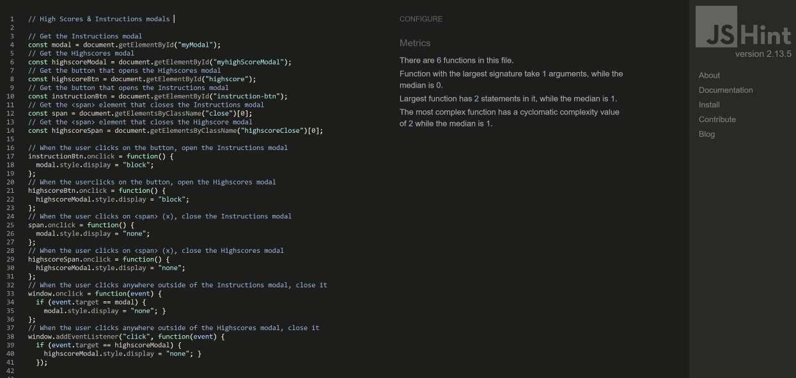

### JSHint Gamepage 
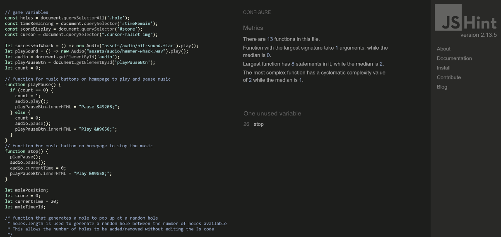

### Testing User Stories from User Experience (UX) Section
#
 1. As a first time user, I want to easily understand how to play the game.

**Simple and informative text on the homepage buttons which allows the user to click on the Instructions button and read up on how to play the game.**

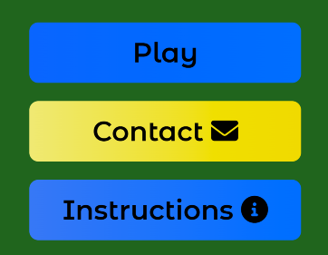

 2. As a user I want the ability to control any background sounds playing. 

 **At the bottom of the homepage is an option to switch the audio on/off and Pause. When you click play the button switches to Pause and when clicked again, returns back to Play**

 

 3. As a user I want to be able to see my current score.

 **The scoreboard can easily be seen during game play at the top of the screen, alongside the time remaining.**

 

 4. As a user I want to recieve an alert at the end of gameplay with my final score.

 **A pop up message alerts the user at the end of gameplay to let the user know that the game is over and gives them a final score.**

 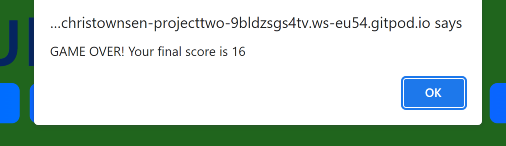

 5. As a user I want simple gameplay which is easy to play again.

 **The game will restart after clicking ok to the alert after game play. The user has the choice to play again or click the home button to return to the home screen.**

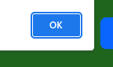
 

 6. As a frequent user, I would like to see the Highscores.

**On the homepage there is a Highscores button, click the button to view the Highscores.**

 7. As a frequent user, I want to learn more about the developer and see if they have added any new content. 

 **At the bottom of each pop up modal for Instructions and Highscores are two social media icons, LinkedIn and Github, there is an effect on hover of the buttons to register interativity with the user.**

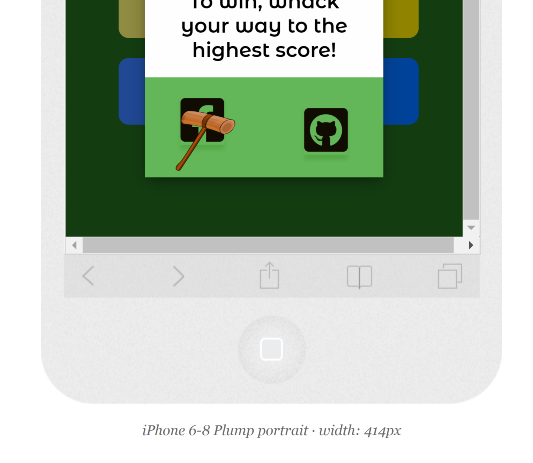
 

 8. As a user I want the ability to play the game on multiple devices.

 **The game has been tested on mutiple devices and tested using responsinator and google dev tools to add specific media queries for certain screen sizes.**

 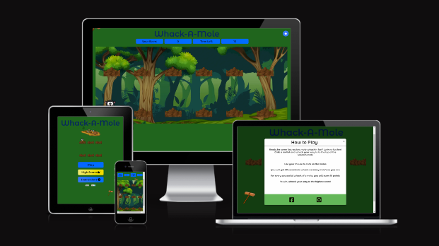

 
### Further Testing
#

-   The Website was tested on Google Chrome, Internet Explorer
-   The website was viewed on a variety of devices such as Desktop, Laptop, Oneplus 5t, iPhone SE, iPhone 6-8, iPhoneX & Samsung Galaxy S21.
-   A large amount of testing was done to ensure that all pages were linking correctly.
-   Friends and family members were asked to review the site and point out any bugs or problems.

### Known Bugs
#
Throughout the project I encountered a number of bugs, some of which were solved and some not which are stated below:

I have noticed that you can still send an email and get the notification without imputting text into the correct boxes of the form. The HTML elements have been told that an input feild is required but the javascript doesn't know that, further research is needed to implement the javascript code to prevent the form from being sent without the required feilds.  

#### Console Bugs
I had an uncaught ReferenceError for my instructionBtn in the console. *resolved* This was resolved by making a seperate javascript file for each of my HTML pages to prevent conflicting code. 
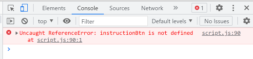

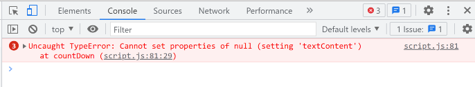

***
## Deployment

### GitHub Pages
#
The project was deployed to GitHub Pages using the following steps...

1. Log in to GitHub and locate the [GitHub Repository](https://github.com/)
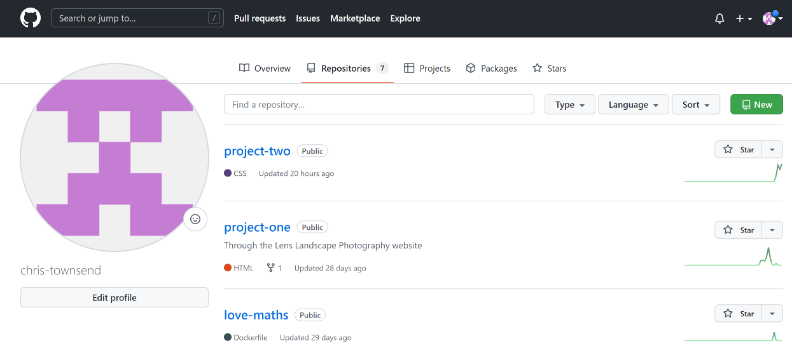

2. At the top of the Repository, locate the "Settings" Button on the menu.
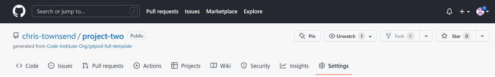    

3. Select "Pages" from the menu on the left-hand side.

    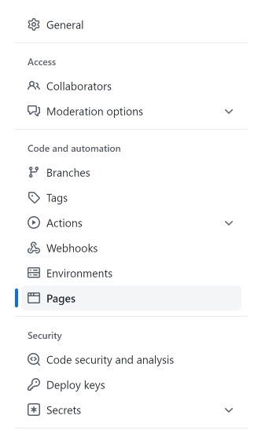

4. Under "Source", click the dropdown bar and select "Main Branch" and click save.
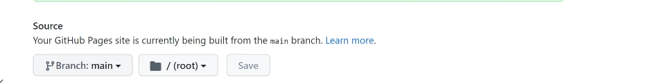

5. The page will automatically refresh and will take a short time to publish the page. The page should turn green once the site has been deployed.
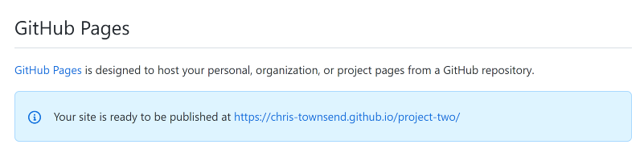

6. Scroll back down through the page to locate the published site [link](https://github.com) in the "GitHub Pages" section.
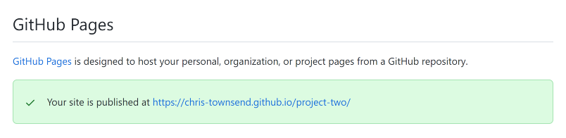

### Forking the GitHub Repository
#

By forking the GitHub Repository you can make a copy of the original repository You can view and/or make changes without affecting the original repository by using the following steps..

1. Log in to GitHub and locate the [GitHub Repository](https://github.com/) you would like to fork.

2. At the top of the Repository, just above the "Settings" Button on the menu, locate the "Fork" Button and you should now have a copy of the original repository in your account.

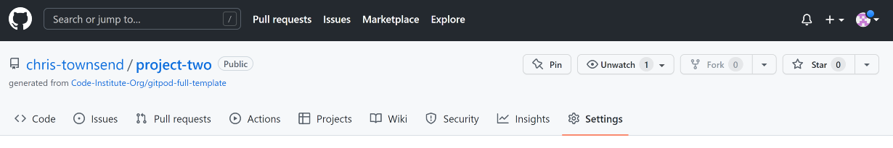

### Making a Local Clone
#

1. Log in to GitHub and locate the [GitHub Repository](https://github.com/)

2. On the repository main page, click the drop down menu called Code.

    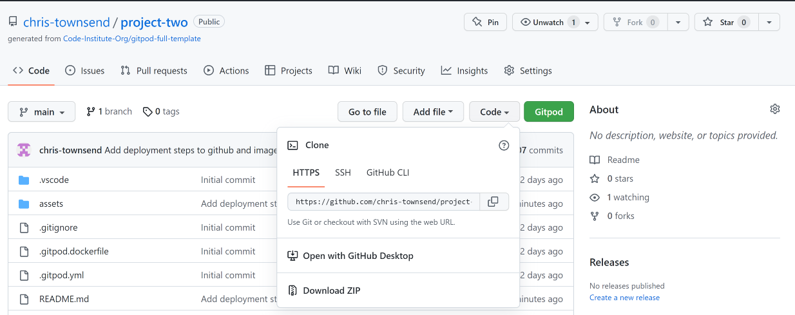

3. To clone the repository using HTTPS, copy the link.

    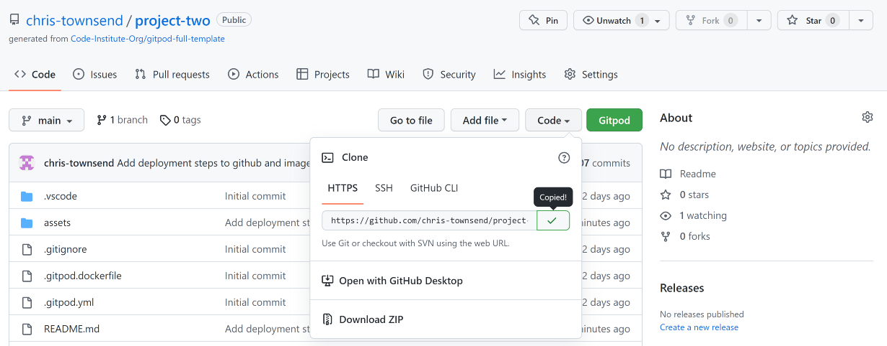

4. Open Git Bash
5. Change the current working directory to the location where you want the cloned directory to be made.
6. Type `git clone`, and then paste the URL you copied in Step 3.

7. Press Enter. Your local clone will be created.

***
## Credits

### Content
#
Helpful tutorials I used to help me with coding some of the design ideas were:

- [Javascript 30 Day Coding Challenge](https://javascript30.com/)

- [Ania Kubów Whac-a-mole in JavaScript](https://www.youtube.com/watch?v=rJU3tHLgb_c&t=1194s)

- [JavaScript Game Tutorial for Beginners](https://www.youtube.com/watch?v=RTb8icFiSfk&list=RDCMUCEqc149iR-ALYkGM6TG-7vQ&index=16)

- [How to create an animated cursor - help from webanimation](https://webanimation.blog/blog/how-to-create-a-custom-cursor-without-using-canvas)

Various resources used to learn were:
- [W3Schools](https://www.w3schools.com/)
- [Stack Overflow](https://stackoverflow.com/)
- [Codecademy](https://www.codecademy.com/)

### Media
#
The Images used on my site have been taken from: 

-  [Clip Art Max](https://www.clipartmax.com/)

-  [Pin Clip Art](https://www.pinclipart.com/)

- [Vecteezy](https://www.vecteezy.com/)

The Sounds used on my site have been taken from:

-  [Free Sounds](https://freesound.org/)

### Acknowledgements
#
-  I would like to thank my Mentor Darío Carrasquel for guidance throughout the project.

-   Tutor support at Code Institute for their support.