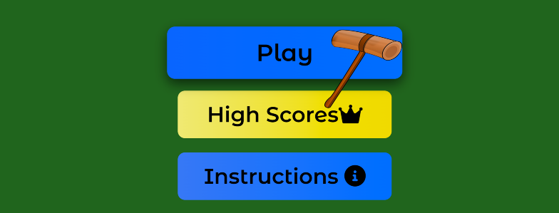

<h1 align="center">Portfolio Project Two - Javascript</h1>

## Live Site
[Whack A Mole](https://chris-townsend.github.io/project-two/index.html)

#

## Repository
[https://github.com/chris-townsend/project-two](https://github.com/chris-townsend/project-two)

***

## Contents
- [Objective](#Objective)
- [Brief](#Brief)
- [User Experience(UX)](#user-experience-ux)
- [Design](#Design)
    - [Colour Scheme](#Colour-Scheme)
    - [Typography](#Typography)
    - [Imagery](#Imagery)
- [Wireframes](#Wireframes)
- [Features](#Features)
    - [Features Left to Implement](#Future-Features)
    - [Languages Used](#languages-Used)
- [Technologies Used](#programs-frameworks--libraries-used)
- [Testing](#Testing)
    - [Testing Stories for UX](#testing-user-stories-from-user-experience-ux-section)
    - [Further Testing](#Further-Testing)
- [Bugs](#Known-Bugs)
- [Deployment](#Deployment)
    - [GitHub Pages](#GitHub-Pages)
    - [Forking the GitHub Repository](#forking-the-github-repository)
    - [Making a local Clone](#making-a-local-clone)
- [Credits](#Credits)
    - [Content](#Content)
    - [Media](#Media)
    - [Acknowledgements](#Acknowledgements)

***

## Objective
#
In this project I intend to make a small game which is easily understood and intuitive to play. It will be based on the classic arcade game Whack-A-Mole where you are given a mallet to hit the moles; as they pop out, you are given a point for each mole hit. I'll be using HTML, CSS and Javascript to make the game and it's designed to be a fun and entertaining game to help pass time. 

***

## Brief & Target Audience 
# 
The game will be designed for a target audience of 6 to 10 years old. The game will be easily laid out with an instructions pop up modal on the homepage. The site will have clear images and sounds responsive to actions made by the user. The game music will have an option to play/pause and stop to prevent autoplaying and give the user a call of action. The game will be timed and the user will know how much time is remaining from the countdown tab above the game board.  

***

## User Experience (UX)
#

-   ### User Requirements

    1. As a first time user, I want to easily understand how to play the game.

    2. As a user I want the ability to control any background sounds playing. 

    3. As a user I want to be able to see my current score.

    4. As a user I want to recieve an alert at the end of gameplay with my final score. 

    5. As a user I want simple gameplay which is easy to play again.

    6. As a frequent user, I would like to see the Highscores.

    7. As a frequent user, I want to check to see if there are any new games available to play by clicking on the developers social media icons clearly laid out at the bottom of the highscores and Instructions modal. 

    8. As a user I want the ability to play the game on multiple devices.
    
     ***

-   ### Design
#
-   #### Colour Scheme
    
     - The colour scheme was picked using coolers. I used these colours because I felt they complimented each other well, It gives the game a fun and cheerful feel and the contrast works well for user reading accessability. The game buttons on the homepage and gamepage have been styled using a background linear-gradient to add to the styled effect.

    

    ***
    -   #### Typography
    #
    The fonts are imported into the CSS file from *[Google Fonts](https://fonts.google.com/)* 

    - The **Montserrat Alternates** font is the main font used throughout the game with **Sans Serif** as the fallback font in case for any reason the font isn't being imported into the site correctly. **Montserrat Alternates** was choosen because it has clear lettering which allows easy reading accessabillity for the user. The buttons on the gamepage are styled with the **Montserrat Alternates** font and this nicely contrasts with the background colour. 
 
    

    

    ***
        
*   ### Wireframes
#

-   Desktop Wireframe Home page  -
    

-   Desktop Wireframe Game page  - 
    

-   Mobile Wireframe Home page -

     

-   Mobile Wireframe Game page -

     

***    

## Features
#

I have used [Responsinator](http://www.responsinator.com/) to check the responsiveness on different devices. The site is responsive on all devices displayed, including ios devices. 

 - [Responsinator Results](http://www.responsinator.com/?url=https%3A%2F%2Fchris-townsend.github.io%2Fproject-two%2Findex.html)

#

1. I have made some of the features on the website **interative**. When you first arrive on the homepage, the main heading "Whack-A-Mole" flashes up and grow on the screen over 2 seconds. This has been accomplished by using *keyframes* with *image-grow*. I have added a suitable image of a man digging a hole under the main heading which also grows on the screen with the heading. The heading and image has been set to grow from a scale of 0.4 to 1.

2. Below my title, I have added an animation of the game. The moles will pop up randomly on the holes, This has been added as a bit of fun and to engage the user. I have created this from using the same javascript code as on my game page. Unfortunatly this was throwing quite a lot of errors in the console due to using the same code but on a different page - please see testing and known bugs for more information.

3. Under my animation I have added 3 buttons, Play which directs you to the game page and a Highscores and Instructions button which open up as pop-up modals. I have added style to the buttons when hovered over to give feedback to the user that is it interative. Icons have been added to the Highscores and Instructions buttons to give more UX.

4. HighScores pop-up modal 

5. Instructions pop-up modal 

6. The social media icons that have been added to the footer of my modals have been made **interative** by using the *hover*: *transform* function. I have used a box shadow for when an icon is hovered over so that the user acknowedges the action. 

6. The headings for the gallery, about and contact page have been made **interactive**. Similar to the main heading, I have used the *image-grow* *keyframes* function. 

7. I wanted to make my gallery images stand out by adding **animation**. I accomplished this by using the *hover* and *transition* function. When you *hover* over an image it eases in over 0.4 seconds and when you unselect, it goes back to its original state. I used the *transition* ease-in-out for this method.

8. My contact page has been made **interative** so that when you input your details into the form, the headings get pushed out of the box and stay above the input boxes. This was accomplished by using the *hover* and *transition* function. I have added extra style to the submit button by adding in an arrow when you *hover* over it. The form will come up with a "Please fill out this feild" message when it hasn't been filled in correctly. This means that a name and email address is *required* before the form can be submitted. 

- *The contact form is **not currently active** as it requires languages I have yet to learn. The form is there to demonstrate the html structure and CSS style*. The 'action' and 'method' attributes have been updated to show the Code Institute form dump page when the form has been filled in correctly, this will open in a new tab. The data inputted won't be collected or stored anywhere at this current time. 

9. At the bottom of all pages within my footer I have added a copyright symbol with the organization and who it was created by. It contains information to improve the websites overall usability. 

10. I wanted to add more structure to my about page so I have added a team's section. At first it was difficult to position the employee heads within the background div but with perseverance and guidance from the Code Institute Love running project, this was accomplished.

***
## Future Features
#
 

### Languages Used
#

-   [HTML5](https://en.wikipedia.org/wiki/HTML5)
-   [CSS3](https://en.wikipedia.org/wiki/Cascading_Style_Sheets)
-   [JS](https://en.wikipedia.org/wiki/JavaScript)

### Programs, Frameworks & Libraries Used
#

- [Balsamiq:](https://balsamiq.com/) Balsamiq was used to create the wireframes during the design process.

- [Pixlr:](https://pixlr.com/x/) Pixlr was used to resize and change the format of my images.

- [Coolors:](https://coolors.co/) Coolors was used to pick a colour scheme and check contrast. 

- [TinyPNG:](https://tinypng.com/) All images within the project have been processed through their free compression tool.

- [Hover.css:](https://ianlunn.github.io/Hover/) Hover.css was used on the Social Media icons on the instructions modal footer to add the float transition while being hovered over.

- [Google Fonts:](https://fonts.google.com/) Google fonts were used to import the 'Montserrat Alternates' font into the style.css file..

- [Font Awesome:](https://fontawesome.com/) Font Awesome was used throughout the website to add icons for aesthetic and UX purposes.

- [Google DevTools:](https://developer.chrome.com/docs/devtools/) Once the website was made to a basic deployment level, Google DevTools was used frequently to resize objects within the site, very helpful for making my website responsive.

- [Git](https://git-scm.com/) Git was used for version control by utilizing the Gitpod terminal to commit to Git and Push to GitHub.

- [GitHub:](https://github.com/) GitHub is used to store the projects code after being pushed from Git.

- [W3C Markup Validator:](https://validator.w3.org/) This site was used to ensure that my HTML and CSS was error free. I had to push my code to ensure it was updated and then add the URL of the website to the address bar which then checked for errors or warnings.

- [Favicon Generator:](https://favicon.io/favicon-converter/) This was used to create my favicon icon. 

 - [Slack:](https://slack.com/intl/en-gb/) Slack is a an online messaging service which allows poeple to collaberate with their workspaces. Slack was incredibly useful for advice from students and tutors.

 - [YouTube:](https://www.youtube.com/) YouTube is a free video sharing website, it has been very useful for watching videos on positioning using flexbox. 

 - [Audio Compressor](https://www.media.io/audio-compressor.html) Media.io was used to compress my audio files without loosing quality. 

 - [Compressor.io](https://compressor.io/)* This was used to reduce the size and load times of my images. 

## Testing
#

The W3C Markup Validator and W3C CSS Validator Services were used to validate every page of the project to ensure there were no syntax errors in the project. The results are shown below:

-   [W3C HTML Markup Validator](https://validator.w3.org/) Results
### Homepage

### Game Page

-   [W3C CSS Markup Validator](https://jigsaw.w3.org/css-validator/) Results

I have run the entire website through Google Chrome's lighthouse audit application and the results are shown below:

- Mobile
### Homepage

### Game Page

- Desktop
### Homepage

### Game Page

### Testing User Stories from User Experience (UX) Section
#

-   #### First Time Visitor Goals

    1. As a First Time Visitor, I want to easily understand the main purpose of the site and learn more about the organisation.

        1. Upon entering the site, users are automatically greeted with a clean and easily readable navigation bar to go to the page of their choice. Underneath there is a quote from a famous landscape artist and gallery cards which will take you straight to the gallery page.
        2. The main points are made immediately with the hero image and the title.
        3. The user has two options, click one of the call to action buttons or scroll down.

    2. As a First Time Visitor, I want to be able to easily be able to navigate throughout the site to find content.

        1. The site has been designed to be fluid and never to entrap the user. At the top of each page there is a clean navigation bar, each link describes what page they will end up on clearly.
        2. On the Contact Us Page, after a form response is submitted, the page refreshes and the user is brought to the top of the page where the navigation bar is.

    3. As a First Time Visitor, I want to easily be able to locate their social media links to see their followings to determine how trusted and known they are.
        1. The user will see the social media icons as soon as they open the site as they are fixed to the bottom of the screen. They are also interative when hovered over.
      

-   #### Returning Visitor Goals

    1. As a Returning Visitor, I want to find the best way to get in contact with the organisation with any questions I may have.

        1. The navigation bar clearly highlights the "Contact" Page.
        2. Here they can fill out the form on the page or alternatively they can message the organisation on social media.
        3. The footer contains links to the organisations Facebook, Twitter and Instagram page as well as the organization's Github.
        4. Whichever link they click, it will be open up in a new tab to ensure the user can easily get back to the website.

     2. As a Returning Visitor, I want to see where the location is based.
         1. A contact map is easily accessable by clicking on the contact header on the navigation bar and scrolling to just below the contact form.
        
-   #### Frequent User Goals

    1. As a Frequent User, I want to check to see if there has been any new photos recently added.

        1. The user would already be comfortable with the website layout and can easily locate the gallery page.

    2. As a Frequent User, I want to get hold of the organization.

        1. The user would already be comfortable with the website layout and can easily click the contact link from the homepage and at the bottom of the page is a google map.

        2. On the contact page there is a form which they can fill out, there is a "Submit" button to the bottom of the input field. The submit button is interative when you hover over it, some arrows will appear to acknowedge you are about to submit the form.

### Further Testing
#

-   The Website was tested on Google Chrome, Internet Explorer and Safari browsers.
-   The website was viewed on a variety of devices such as Desktop, Laptop, Oneplus 5t, iPhone SE, iPhone 6-8, iPhoneX & Samsung Galaxy S21.
-   A large amount of testing was done to ensure that all pages were linking correctly.
-   Friends and family members were asked to review the site and point out any bugs or problems.

### Known Bugs
#

-   On some small mobile devices the contact map pushes the size of the screen out more than any of the other content on the page.
    -   A white gap can be seen to the right and above the map. To fix this problem I have reduced the width size of the map as screen size decreases to make it more responsive. On some very small devices, there may still be a small gap but works on majority of devices.

- When testing my code through the W3C validator, it came up with a lower score for accessability. This was due to not adding a title to my iframe google map, this has now been added and increased the score for accessability.

- I originally had the colour Grey for my writing on my about page. This lowered my accessability score so I changed it back to black to compensate for accessability.

- When testing my site through [Responsinator](http://www.responsinator.com/) The site would occassionally display my nav bar differently at 412px and 414px. When I refresh the page a couple of times it will show it correctly, I'm not quite sure what is causing this and still unsure now. I have tested the responsiveness using Google DevTools and it is showing up correctly on there at 412px and 414px.  

- I have noticed that my bottom footer at 684px and 667px wide (Android Pixel 2 landscape view & Apple Iphone 6-8 landscape view) is showing up incorrectly. It is showing further up the page near the bottom of the second gallery card instead of sitting at the bottom of the page. I have tried to resolve this issue by adding a media query but it puts bad UX on other devices so I have left this unresolved for now as it only seems to be a small problem when viewed landscape.

***
## Deployment

### GitHub Pages
#
The project was deployed to GitHub Pages using the following steps...

1. Log in to GitHub and locate the [GitHub Repository](https://github.com/)

2. At the top of the Repository, locate the "Settings" Button on the menu.
    

3. Select "Pages" from the menu on the left-hand side.

    

4. Under "Source", click the dropdown bar and select "Main Branch" and click save.

5. The page will automatically refresh and will take a short time to publish the page. The page should turn green once the site has been deployed.

6. Scroll back down through the page to locate the published site [link](https://github.com) in the "GitHub Pages" section.

### Forking the GitHub Repository
#

By forking the GitHub Repository you can make a copy of the original repository You can view and/or make changes without affecting the original repository by using the following steps..

1. Log in to GitHub and locate the [GitHub Repository](https://github.com/) you would like to fork.

2. At the top of the Repository, just above the "Settings" Button on the menu, locate the "Fork" Button and you should now have a copy of the original repository in your account.

### Making a Local Clone
#

1. Log in to GitHub and locate the [GitHub Repository](https://github.com/)

2. On the repository main page, click the drop down menu called Code.

    

3. To clone the repository using HTTPS, copy the link.

    

4. Open Git Bash
5. Change the current working directory to the location where you want the cloned directory to be made.
6. Type `git clone`, and then paste the URL you copied in Step 3.

7. Press Enter. Your local clone will be created.

***
## Credits

### Content
#
- The LoveRunning project from Code Institute was very helpful and gave me inspiration for my own website, espeically for creating the navbar.

- Various videos across Youtube about positioning using flexbox.

### Media
#
The Images used on my game have been taken from: 

-  [Clip Art Max](https://www.clipartmax.com/)

-  [Pexels](https://www.pexels.com/)

The Sounds used on my game have been taken from:

-  [Free Sounds](https://freesound.org/)

### Acknowledgements
#
-  I would like to thank my Mentor Darío Carrasquel for guidance throughout the project.

-   Tutor support at Code Institute for their support.